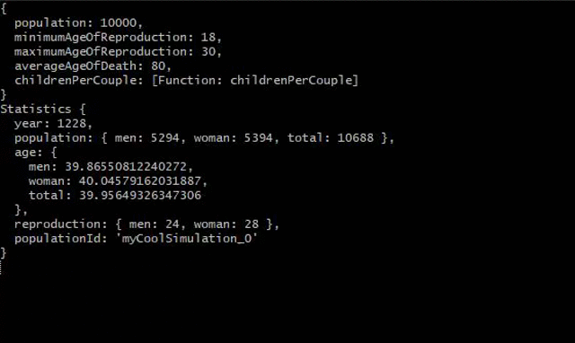

# Population Growth Simmulation
This is a completely not scientifical simmulation of the growth of a population.
The only reason I started with this project was a talk from Uncle Bob where he asked "How many Biological Parents do you have". 

## Problems
1. [x] I haven't found a right configuration yet in which the population does go distinct after a while. It always seems to grow no matter what.
    + One possible Solution I implemented was to generate the maximum amount of children a Human can get from 0 .. 4. this way Populations seemed to no longer life on forever with this Configuration:
        ```js 
          runSimulation({
              population: 100,
              minimumAgeOfReproduction: 28,
              maximumAgeOfReproduction: 30,
              averageAgeOfDeath: 30,
              childrenPerCouple: () => Math.floor(Math.random() * 3)
          });
      ```
      + Never ending simulation:
      
2. [ ] Currently, only the current state of a simulation is printed. I want to somehow track the progress of a population.
    + possible solution is to rewrite the print function to a function that just extracts the current stats and then save these stats somewhere.

